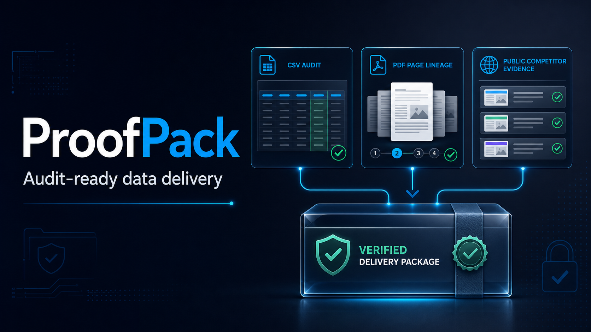

# ProofPack



[](https://github.com/TonyInsightOps/proofpack-agent-skills/actions/workflows/test.yml)


[](LICENSE)

> **Local-only and stdlib-only:** the helper scripts make no network requests,
> emit no telemetry, require no credentials, and use only the Python standard
> library. Python 3.9 or newer is required.

**Evidence hygiene for freelancers.** ProofPack checks whether common data-work
deliverables contain the minimum traceability needed for review. It does not
replace human verification, dedicated extraction/cleaning/monitoring tools, or
professional judgment.

ProofPack is a small collection of audit-ready agent skills for three jobs that
often fail silently:

- auditing deterministic CSV cleaning results;
- validating page-linked records that have already been extracted from PDFs;
- validating a prepared register of public competitor evidence.

Each skill requires lineage, reconciliations, exception logs, and explicit
limits. The examples use synthetic data only and are safe to inspect or reuse.

## Why this exists

AI output is easy to generate but expensive to trust. A cleaned file without a
change log, a spreadsheet without page references, or a market-research summary
without URLs leaves the reviewer doing the work twice. ProofPack turns those
checks into part of the deliverable.

## Three validators and their hard boundaries

| Skill | Validator | Hard boundary |
|---|---|---|
| `excel-audit` | `audit_csv.py` profiles missing values, finds exact duplicate keys, optionally keeps the first, and writes reconciliation evidence | CSV only; no XLSX parsing, fuzzy merging, inferred values, or business-rule guessing |
| `pdf-table-proof` | `build_proof_manifest.py` checks an already-extracted CSV register for source/page lineage and QA exceptions | No PDF opening, table extraction, rendering, OCR, or visual accuracy verification |
| `competitor-evidence-pack` | `validate_evidence.py` checks a prepared public-source register for URLs, timestamps, observations, confidence, status, and coverage | No web fetching, scraping, truth verification, analysis generation, outreach, or posting |

## Differentiator: deterministic evidence change ledger

Recurring monitoring fails when a new collection timestamp is mistaken for a
real change. `compare_evidence.py` compares two prepared evidence registers by
company, category, and source URL, while deliberately excluding collection time
from change classification. It reports `added_check`, `changed`, `unchanged`,
and `missing_from_current`, identifies the exact fields that changed, and emits
a SHA-256 fingerprint for each before/after state.

The ledger creates a review queue; it does **not** decide whether a difference
is material. A missing current check is not proof that a page or fact
disappeared, and every commercial interpretation still requires source review.

## Quick start

There is no installation, account, API key, or service to configure. Open a
terminal in the directory containing this README and run the safe local demo:

```bash
python3 scripts/run_demo.py
```

It uses only the bundled synthetic/placeholder fixtures and prints a clear
`[PASS]` or `[FAIL]` for each validator. To run validators individually:

```bash
python3 skills/excel-audit/scripts/audit_csv.py \
  skills/excel-audit/assets/synthetic_customers.csv \
  --key email --dedupe keep-first --output-dir demo-output/excel

python3 skills/pdf-table-proof/scripts/build_proof_manifest.py \
  skills/pdf-table-proof/assets/synthetic_extraction.csv \
  --output demo-output/pdf-proof.json

python3 skills/competitor-evidence-pack/scripts/validate_evidence.py \
  skills/competitor-evidence-pack/assets/public_demo_evidence.csv \
  --output demo-output/evidence-check.json

python3 skills/competitor-evidence-pack/scripts/compare_evidence.py \
  skills/competitor-evidence-pack/assets/public_demo_evidence.csv \
  skills/competitor-evidence-pack/assets/public_demo_evidence_current.csv \
  --output demo-output/evidence-delta.json
```

Run all tests:

```bash
python3 -m unittest discover -s tests -v
```

### PDF scope: validation, not extraction

`build_proof_manifest.py` does **not** open or parse PDF files, extract tables,
render pages, or run OCR on scanned documents. Its input is a CSV extraction
register produced by a person or a separate extraction tool. It validates the
register's page/source lineage and QA fields, then produces a proof manifest.
It cannot verify that OCR or transcription matches the visual source; material
exceptions still require visual review.

## Current testing scope

The current suite contains exactly ten tests:

1. Excel sample rows reconcile after deterministic keep-first deduplication.
2. Excel output cannot overwrite the only source file.
3. CSV rows with more fields than the header are rejected.
4. The synthetic PDF extraction register produces a proof-ready manifest.
5. Reused record IDs in different source files are scoped independently.
6. PDF extraction rows with a blank source filename are rejected.
7. The public-placeholder competitor register passes its delivery checks.
8. Competitor evidence without a public URL, timezone-aware timestamp,
   observation, or usable success confidence is rejected.
9. The change ledger detects changed, added, missing, and unchanged checks while
   ignoring collection-time-only differences.
10. Duplicate company/category/source identities are rejected before comparison.

The fixtures are intentionally small and synthetic or use placeholder public
URLs. The suite tests the helpers' validation contracts; it does not test XLSX
parsing, fuzzy matching, OCR, PDF rendering, visual transcription accuracy,
live webpage collection, robots/terms compliance, large-file performance, or
the truth of research conclusions. Those capabilities must not be inferred
from a green test run.

## Privacy promise

Do not place credentials, identity documents, private customer material,
personal contact lists, or confidential business records in a public
repository. See [SECURITY.md](SECURITY.md).

## Commercial use

The MIT license permits commercial use. The open skills are deliberately small;
paid work can cover custom rules, larger document sets, private deployment,
review, and recurring monitoring. Use a funded marketplace contract or another
lawful payment channel before beginning paid work.

### Need an analyst-reviewed deliverable?

I offer fixed-scope CSV audits, page-linked PDF extraction QA, and public-source
competitive research. Every paid engagement starts only after the marketplace
contract is active and funded.

| Service | Typical starter scope | Starting price |
|---|---|---:|
| CSV data-quality mini audit | Up to 5,000 rows, one deterministic duplicate key, cleaned CSV, exception log, QA summary | US$99 |
| PDF-to-table proof pack | Page-linked extraction register, exception log, reconciliation, review notes | US$149 |
| Competitive intelligence research pack | Five companies, source-linked evidence register, executive brief | US$299 |

**[Hire me on Upwork](https://www.upwork.com/freelancers/~0126ecd9d346d44de2)**

For privacy, do not attach customer files or personal data to GitHub issues.
Scope and private file transfer begin only after the contract is active and funded.

---

# ProofPack 中文说明

**任何 AI 都能给结果，ProofPack 要求它证明自己改了什么。**

ProofPack 的定位是给自由职业数据交付做“证据卫生检查”，不是替代人工复核、
专业清洗/OCR/监控工具或专业判断。三个辅助脚本仅使用 Python 标准库，
不联网、无遥测、无需凭据。示例全部是合成或公开占位数据。

其中 PDF 辅助脚本只验证已经提取好的 CSV 记录、页码和来源字段；它不读取
PDF、不做扫描件 OCR，也不能替代对原始页面的人工核验。运行需要 Python
3.9 或更高版本，无需安装第三方依赖、登录账户或提供 API 密钥。

两期公开证据表还可以生成确定性的变化账本。账本会忽略单纯的采集时间变化，
列出新增、变化、未复现与未变化记录，并保留前后指纹；它只生成复核队列，
不会自动断言某项差异具有商业重要性。

短期用途是作为自由职业投标的可验证作品；长期可扩展为批量清洗工具、
PDF 审计工具和持续竞品监控服务。
